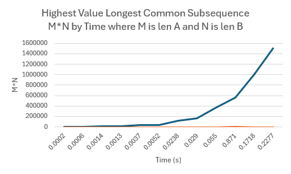

# Algo-programming-assignment-3

Name: Tiffany Dang (UFID: 14332676)

## How to run
To run the algorithm with an input file:
```bash
python3 src/hvlcs.py data/[input_file]
```
Example:
```bash
python3 src/hvlcs.py data/example.in
```

To generate 12 tests and a table with runtime information:
```bash
python3 src/benchmark.py
```

• Instructions to run the code that runs each of the eviction policies, including
example commands.
• Any assumptions (input/output format, dependencies, etc.).
• Your solution to the written component, i.e., Questions 1, 2, and 3.

## Question 1: Empirical Comparison

Ran python3 src/benchmark.py to create random input files and ran them

| Test | Len A | Len B | m*n       | Time (s) |
|------|-------|-------|-----------|----------|
| 1    | 25    | 50    | 1,250     | 0.0002   |
| 2    | 50    | 100   | 5,000     | 0.0006   |
| 3    | 75    | 150   | 11,250    | 0.0014   |
| 4    | 100   | 100   | 10,000    | 0.0013   |
| 5    | 200   | 150   | 30,000    | 0.0037   |
| 6    | 200   | 200   | 40,000    | 0.0052   |
| 7    | 300   | 400   | 120,000   | 0.0238   |
| 8    | 400   | 400   | 160,000   | 0.0290   |
| 9    | 500   | 750   | 375,000   | 0.0550   |
| 10   | 750   | 750   | 562,500   | 0.0871   |
| 11   | 1000  | 1000  | 1,000,000 | 0.1718   |
| 12   | 1000  | 1500  | 1,500,000 | 0.2277   |

## m*n by runtime graph


## Question 2: Recurrence Equation

**Def.** dp[i][j] = max value common subsequence of A[1, …, i] and B[1, …, j].

**Base cases:** dp[0][j] = 0 and dp[i][0] = 0 (if either prefix is empty, no common subsequence)

**Case 1:** A[i] = B[j] => the characters match.

Can extend the best solution for A[1…i-1] and B[1…j-1] by appending this character, adding v(A[i])

**Case 2:** A[i] ≠ B[j] => the characters don't match.

Either skip A[i] → look at dp[i-1][j]
Or skip B[j] → look at dp[i][j-1]
Take the better one.

### Recurrence eq:
```
dp [i][j] = {
    dp [i-1][j-1] + v(A[i])           if A[i] = B[j]
    max(dp [i-1][j], dp [i][j-1])     otherwise
}
```


## Question 3: Big-O
```bash
HVLCS(string A w/ length m, string B w/ length n, value function v):
    for i from 0 to m: <= O(m)
        dp[i, 0] = 0
    for j from 0 to n: <= O(n)
        dp[0, j] = 0
    for i from 1 to m: <= O(m) * O(n)
        for j from 1 to n:
            if A[i] = B[j]:
                dp[i, j] = dp[i-1, j-1] + v(A[i])
            else
                dp[i, j] = max(dp[i-1, j], dp[i, j-1])
    return dp[m, n]
```
The runtime of the algorithm is O(m * n) because there are 2 nested loops that iterate m and n times respectively, and each interation only does O(1) work. Other parts of the algorithm are initializing the table which is only O(m + n) which is dominated by the O(m * n) term. So, the overall runtime is O(m * n).